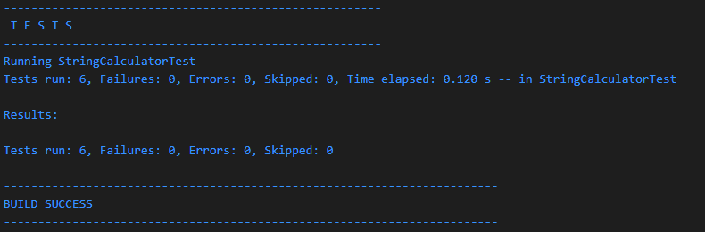
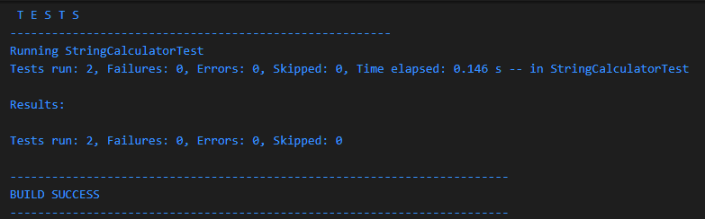
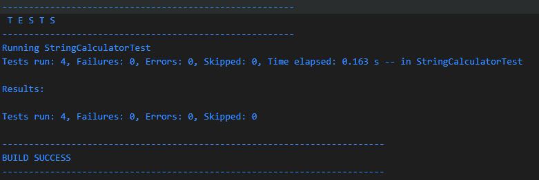

# 🧪 String Calculator – TDD Kata (Java + JUnit)

This project is a solution to the **String Calculator TDD Kata**, implemented using **Java 17** and **JUnit 5**, following strict **Test-Driven Development (TDD)** practices.

This project is built as part of a recruitment assessment for **Incubyte** to demonstrate clean code, TDD discipline, and testability.

---

## ✅ Requirements Implemented

| Feature | Status |
|--------|--------|
| Return 0 for an empty string | ✅ |
| Return number for single input | ✅ |
| Return sum for two comma-separated numbers | ✅ |
| Handle multiple numbers | ✅ |
| Support newline (`\n`) as delimiter | ✅ |
| Support custom delimiter using `//[delimiter]\n` format | ✅ |
| Throw exception for negative numbers and list them in message | ✅ |

---

## 🧪 TDD Workflow Followed

1. Write a failing test (red)
2. Write the minimum code to pass (green)
3. Refactor to clean up code
4. Commit after each step

---

## 📁 Project Structure

```
string-calculator-tdd/
├── 📂 src/
│   ├── 📂 main/
│   │   └── 📂 java/
│   │       └── 📂 org/
│   │           └── 📂 incubyte/
│   │               └── 📄 StringCalculator.java
│   └── 📂 test/
│       └── 📂 java/
│                   └── 📄 StringCalculatorTest.java
├── 📂 screenshots/
│   ├── 📸 Test-1.png
    ├── 📸 Test-2.png
    ├── 📸 Test-3.png
    ├── 📸 Test-4.png
    ├── 📸 Test-5.png
│   └── 📸 Test-6.png
├── 📄 pom.xml
└── 📄 README.md
```

### 📋 Key Files Description

| File/Directory | Purpose |
|---------------|---------|
| `src/main/java/org/incubyte/StringCalculator.java` | Main implementation class with calculator logic |
| `src/test/java/StringCalculatorTest.java` | JUnit 5 test suite following TDD principles |
| `pom.xml` | Maven configuration with dependencies and build settings |
| `Screenshots/` | Visual evidence of test execution and results |
| `README.md` | Project documentation and setup instructions |

---

## ⚙️ Technologies Used

| Tool         | Purpose              |
|--------------|----------------------|
| Java 17      | Core programming     |
| JUnit 5      | Unit testing         |
| Maven        | Dependency management |
| IntelliJ IDEA| Development IDE      |

---

## 🚀 How to Run

### 🧪 Run All Tests

**From IntelliJ:**
Right-click `StringCalculatorTest.java` → Run

**From Command Line:**
```bash
mvn clean test
```

**From Maven:**
```bash
mvn test
```

---

## 📸 Screenshots

Include screenshots showing:
### ✅ JUnit Test Results


### 📊 Intermediate Test Results




---

## 📌 Sample Usage

Although this is a library-style TDD project, here's an example:

```java
StringCalculator calc = new StringCalculator();
int result = calc.add("//;\n1;2");
System.out.println(result); // Output: 3
```

---

## 📜 Git Commit History

Each feature was added using TDD and committed after:
- ✅ Add support for empty string input
- ✅ Handle single number input
- ✅ Support two comma-separated numbers

---

## 👤 Author

**Khushi Ruparelia**  
Passionate about Coding
